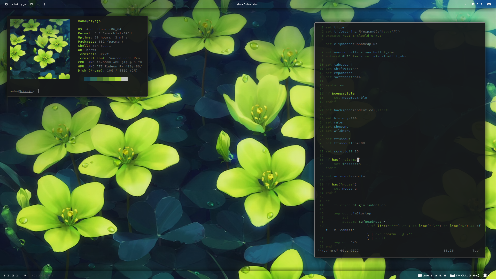
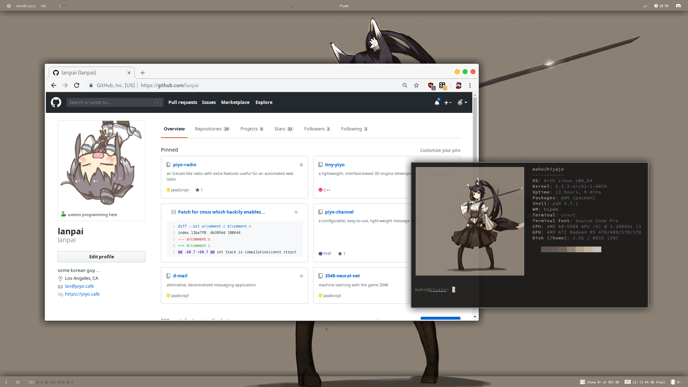
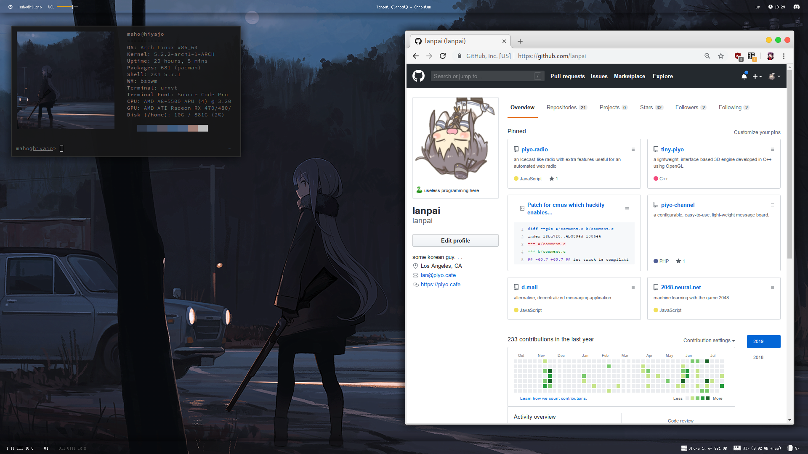

# .files :blossom: :four_leaf_clover: :herb:
custom dotfiles for arch rice

## :minidisc: Programs

### :camera: Visual
| Name | Description |
| --- | --- |
| [bspwm](https://wiki.archlinux.org/index.php/Bspwm) | tiling window manager that represents windows as the leaves of a full binary tree |
| [Polybar](https://wiki.archlinux.org/index.php/Polybar) | fast and easy-to-use tool for creating status bars |
| [Compton](https://wiki.archlinux.org/index.php/Compton) | standalone compositor for Xorg |
| [dunst](https://wiki.archlinux.org/index.php/Dunst) | lightweight replacement for the notification-daemons provided by most desktop environments |
| [pywal](https://github.com/dylanaraps/pywal) | generate and change color-schemes on the fly |
| [McMojave](https://github.com/vinceliuice/Mojave-gtk-theme) | macOS Mojave like theme which supports GTK 3 and GTK 2 based desktop environments |
| [feh](https://wiki.archlinux.org/index.php/Feh) | lightweight and powerful image viewer that can also be used to manage the desktop wallpaper for standalone window managers lacking such features |

### :computer: General Tools
| Name | Description |
| --- | --- |
| [ranger](https://wiki.archlinux.org/index.php/Ranger) | text-based file manager written in Python |
| [vim](https://wiki.archlinux.org/index.php/Vim) | extended version of vi with additional features |
| [zsh](https://wiki.archlinux.org/index.php/Zsh) | powerful shell that operates as both an interactive shell and as a scripting language interpreter |
| [Transmission](https://wiki.archlinux.org/index.php/Transmission) | light-weight and cross-platform BitTorrent client |
| [ImageMagick](https://wiki.archlinux.org/index.php/ImageMagick) | free and open-source software suite for displaying, converting, and editing raster image and vector image files |

### :paperclip: Misc
| Name | Description |
| --- | --- |
| [neofetch](https://www.archlinux.org/packages/community/any/neofetch/) | CLI system information tool written in BASH that supports displaying images |
| [sxhkd](https://wiki.archlinux.org/index.php/Sxhkd) | simple X hotkey daemon, by the developer of bspwm, that reacts to input events by executing commands |
| [scrot](https://www.archlinux.org/packages/community/x86_64/scrot/) | simple command-line screenshot utility for X |
| [PulseAudio](https://wiki.archlinux.org/index.php/PulseAudio) | general purpose sound server intended to run as a middleware between your applications and your hardware devices |

## :page_facing_up: Usage

**Alt + Left Click (drag)** moves window

**Alt + Right Click (drag)** resizes window

**wallpaperchange (path)** changes wallpaper to the path, runs pywal, and restarts necessary programs

**wallpaperopen** runs wallpaperchange on the previously used wallpaper; persistent through restart

**PrintScr** uploads screenshot and copies into xclipboard

**Shift + PrintScr** uploads screenshot, uploads to i.piyo.cafe, and places url in clipboard if successful

**Alt [ + Shift] + Enter** opens URxvt (shift modifier opens a floating terminal)

**Alt + D** runs customized dmenu_run

**Alt + Shift + R** reloads sxhkd

**Alt + Super + Q** closes bspwm

**Alt [ + Shift] + Q** closes focused window (shift modifier kills window)

**Alt + Shift + Space** toggles focused window between floating and tiled

**Alt + T** changes focused window to tiled

**Alt + Shift + T** changes focused window to pseudo tiled

**Alt + S** changes focused window to floating

**Alt + F** changes focused window to fullscreen

**Alt + Shift + (Left,Down,Up,Right)** swaps focused window to direction

**Alt + (Left,Down,Up,Right)** swaps focus to window in direction

**Alt + Shift + (1-9,0)** moves window to selected workspace

**Alt + (1-9,0)** swaps to selected workspace

**Alt + Ctrl + (Left,Down,Up,Right)** resizes focused window
